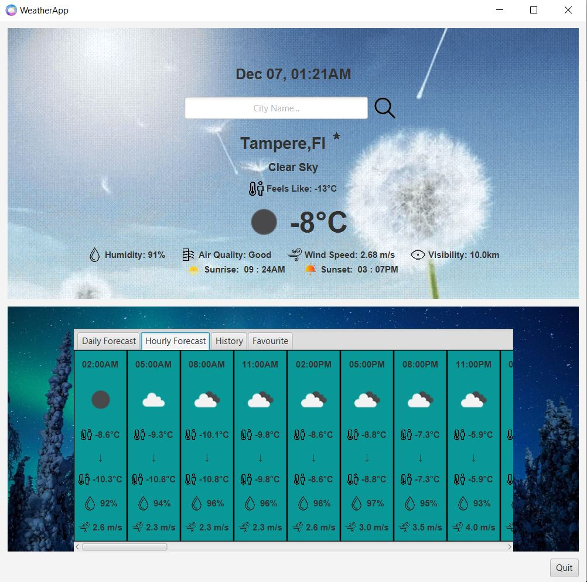

# WeatherApp
This is a Weather App using OpenWeather Api. 

WeatherApp is an easy-to-use application that provides users with real-time weather information for their desired locations. The app seamlessly interfaces with a dedicated weather API to deliver a comprehensive and visually appealing weather experience, leveraging a robust architecture and featuring a sleek graphical user interface. Furthermore, some additional key features are available to enhance their app-using experiences.

Short User Manual:

Launch and Engage: Open the WeatherApp portal to explore a colorful, user-friendly graphical universe that has been painstakingly created by the creative minds behind the scenes, the `WeatherApp’ class. The user interface is smooth and visually appealing right from the start of your weather exploration adventure. Follow this step to 
run this in a IDE: -> mvn clean install -> click the start or mvn clean javafx:run

@Author: Anisul Mahmud. 
